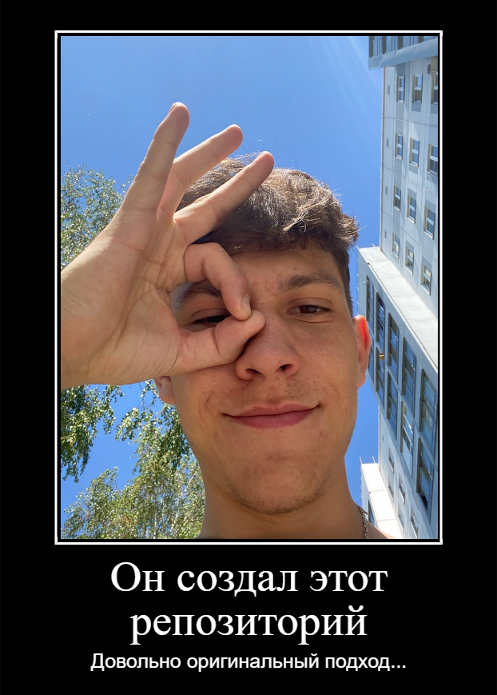

README.md
# 👋🏻Добро пожаловать в мой репозиторий ! 🗿
  ➢ Меня зовут __Рябов Николай__.  
    
  ➢👨‍🎓 Я студент _ЮУрГУ_, учусь на первом курсе, специальность: програмная инженерия, группа КЭ - 103.  
    
  ➢👨‍💻В этом репозитроии вы можете отследить мой прогресс в развитии как рзработчика.  
    
  ➢✅ В каждой папке с названием "lab." - загружена определённая практическая.  
    
  ➢🛑[Мой ВК](https://vk.com/kolyamba838)  
    
  ➢🔮 Список практических работ 🔮  
      *[Lab_2](https://github.com/Shevone/ABOBA/tree/master/lab2)  
      *[Lab_3](https://github.com/Shevone/ABOBA/tree/master/lab3)  
      *[Lab_4](https://github.com/Shevone/ABOBA/tree/master/lab4)  
      *[Lab_5](https://github.com/Shevone/ABOBA/tree/master/lab5)  
      *[Lab_6](https://github.com/Shevone/ABOBA/tree/master/lab6)  
      *[Lab_7](https://github.com/Shevone/ABOBA/tree/master/lab7)  
      *[Lab_8](https://github.com/Shevone/ABOBA/tree/master/lab8)  
Если интересно можно заходить везде и смотреть ВСЕ! 👀  
>«Если сделаю - узнаете, если не сделаю, не узнаете»  

##### А это автор репозитория  

